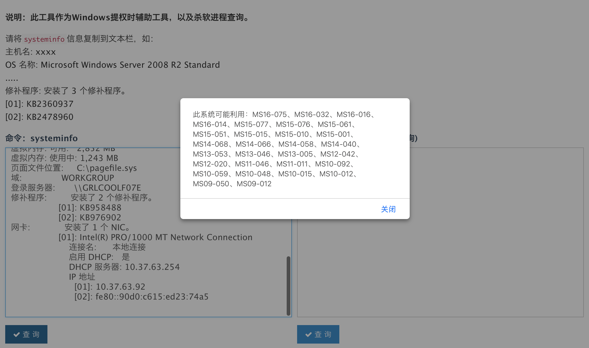
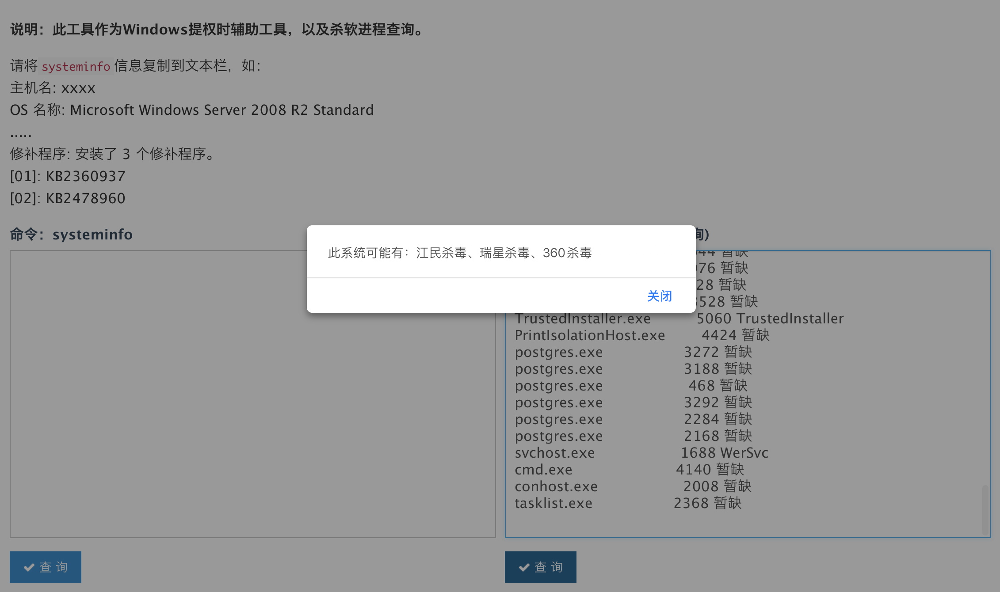
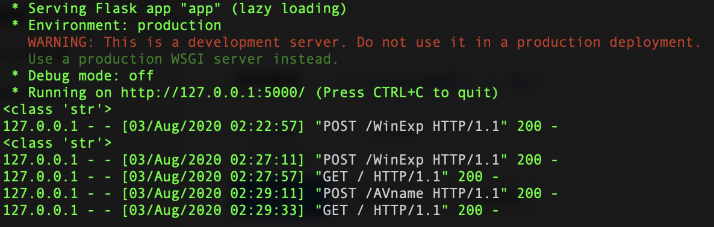

## #介绍

通常在做测试的时候拿到低权限shell往往满足不了。可是在提权会带来一些困扰，不知道系统到底存在什么样的提权漏洞～～～  「 大佬除外」

___就此～ “他” 诞生了虽然并不是第一个有这种想法的人，但是想拥有自己的 “他” !___

此🦶📒可以分为命令行和Web服务版，满足你的多种需求🐶  --web版附带杀软查询

## #运行

```shell
Web版
======
python3 app.py

命令版
======
python3 WinEXP.py <保存systeminfo的文件>
```

## #演示

```
在文件根目录下启动! 在文件根目录下启动! 在文件根目录下启动!   
python3 app.py
```

- **粘贴systeminfo**



- **粘贴tasklist /svc**



- **后台输出**

